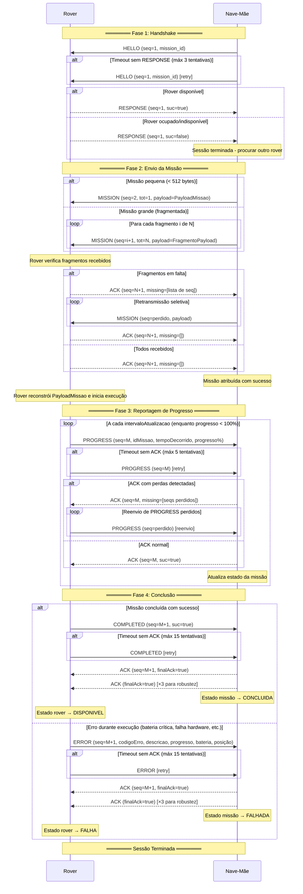

# MissionLink (ML)

Comunicação fiável de missões sobre UDP.

### Estrutura das Mensagens

Cada mensagem ML inclui um **cabeçalho** e um **corpo (payload)**.

| Campo          | Tipo    | Descrição                                                                                                    |
| -------------- | ------- | -------------------------------------------------------------------------------------------------------------- |
| `type`       | enum    | Tipo da mensagem (`HELLO`, `RESPONSE`, `MISSION`, `ACK`, `PROGRESS`, `COMPLETED`, `ERROR`)                     |
| `seq`        | int     | Número de sequência                                                                                          |
| `tot`        | int     | Número total de fragmentos a enviar                                                                          |
| `suc`        | boolean | Indica o sucesso ou não da receção da mensagem total, ou uma resposta positiva/negativa                       |
| `mission_id` | int     | Identificador único da missão                                                                                |
| `idEmissor`  | int     | Identificador do emissor (0 = Nave-Mãe, >0 = Rover)                                                          |
| `idRecetor`  | int     | Identificador do recetor                                                                                      |
| `payload`    |         | Dados específicos da mensagem                                                                                 |

O conteúdo do payload varia consoante o tipo de mensagem:

- `HELLO`: vazio (apenas header com mission_id)
- `RESPONSE`: vazio (header.flagSucesso indica disponibilidade)
- `MISSION`: identificação, área geográfica (x1,y1,x2,y2), tarefa, duração, frequência das atualizações, data início, prioridade
- `ACK`: missing[] (fragmentos/progress perdidos), finalAck (indica fim de sessão)
- `PROGRESS`: idMissao, tempoDecorrido, progressoPercentagem
- `COMPLETED`: vazio (header.flagSucesso indica sucesso/falha)
- `ERROR`: idMissao, codigoErro, descricao, progressoAtual, bateria, posicaoX, posicaoY, timestampErro

### Mecanismo de Fiabilidade

1. Cada mensagem tem um **número de sequência (`seq`)** e o **número total de fragmentos** a ser transmitidos.
2. O recetor responde com um **ACK {seq}** e, no caso de se ter perdido algum pacote, indica que pacotes não recebeu para serem retransmitidos.
3. Se a nave mãe não receber o ACK dentro de um tempo limite, **retransmite** a mensagem.

---

### Fluxo de Comunicação

```
1. Nave-Mãe → HELLO (Inicia o contato com o rover, informando que há uma missão disponível (mission_id, seq=1))
2. Rover → RESPONSE (Confirma que está ativo e pronto para receber a missão (seq=1, suc=true))
3. Nave-Mãe → MISSION ((seq=2..N)  
   Envia todos os fragmentos da missão, contendo partes do payload.)
4. Rover → ACK (Analisa os fragmentos recebidos e envia um ACK seletivo:
     - Se faltarem fragmentos → ACK (missing=[lista de seq])  
     - Se todos foram recebidos → ACK (missing=[]))

5. [Opcional] Nave-Mãe → MISSION (Caso o ACK indique fragmentos faltantes, 
a Nave-Mãe retransmite apenas esses pacotes.) 

    - Rover → ACK   
        Confirma a receção completa (missing=[]).  
        Comunicação concluída com sucesso.
   
```

## Diagrama de sequência



### Notas de Implementação

**Timeouts e Retries:**
- HELLO/RESPONSE: timeout 5s, máx 3 tentativas
- MISSION/ACK: timeout 5s, máx 3 tentativas
- PROGRESS: timeout 3s, máx 5 tentativas
- COMPLETED/ERROR: timeout 3s, máx 15 tentativas (mensagens críticas)

**Fragmentação:**
- Tamanho máximo por fragmento: 512 bytes
- Campos serializados com nome identificador para reconstrução
- Campos grandes são subdivididos com índice de parte

**ACK Final:**
- Flag `finalAck=true` indica ao rover para parar retransmissões
- Enviado 3 vezes consecutivas para garantir entrega (99.9% assumindo 10% perda)
