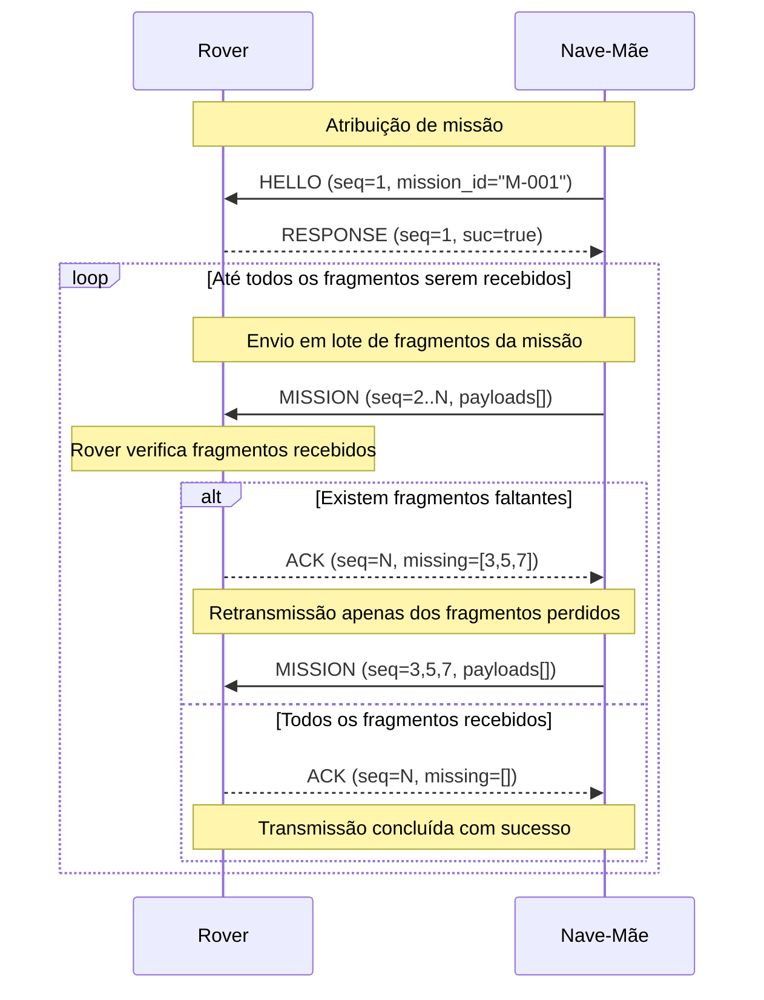

# MissionLink (ML)

Comunicação fiável de missões sobre UDP.

### Estrutura das Mensagens

Cada mensagem ML inclui um **cabeçalho** e um **corpo (payload)**.

| Campo          | Tipo    | Descrição                                                                                                    |
| -------------- | ------- | -------------------------------------------------------------------------------------------------------------- |
| `type`       | ??      | Tipo da mensagem (`HELLO`,`RESPONSE`, `MISSION`, `ACK`)                                                |
| `seq`        | int     | Número de sequência                                                                                          |
| `tot`        | int     | Número de total de fragmentos a enviar                                                                        |
| `suc`        | boolean | Indica o sucesso ou não da receção da mensagem total, ou uma resposta positiva/negativa, por parte do rover |
| `mission_id` | int     | Identificador único da missão                                                                                |
| `timestamp`  | int     | Instante de criação                                                                                          |
| `payload`    |         | Dados específicos da mensagem                                                                                 |

O conteúdo do payload varia consoante o tipo de mensagem:

- `MISSION`: identificação, área geográfica, tarefa, duração, frequência das atualizações, data início, prioridade da missão
- `ACK`: no caso de se terem perdido pacotes, indica quais os fragmentos que não recebeu
- `RESPONSE`: vazio?
- `HELLO`: vazio?

### Mecanismo de Fiabilidade

1. Cada mensagem tem um **número de sequência (`seq`)** e o **número total de fragmentos** a ser transmitidos.
2. O recetor responde com um **ACK {seq}** e, no caso de se ter perdido algum pacote, indica que pacotes não recebeu para serem retransmitidos.
3. Se a nave mãe não receber o ACK dentro de um tempo limite, **retransmite** a mensagem.

---

### Fluxo de Comunicação

```
1. Nave-Mãe → HELLO (Inicia o contato com o rover, informando que há uma missão disponível (mission_id, seq=1))
2. Rover → RESPONSE (Confirma que está ativo e pronto para receber a missão (seq=1, suc=true))
3. Nave-Mãe → MISSION ((seq=2..N)  
   Envia todos os fragmentos da missão, contendo partes do payload.)
4. Rover → ACK (Analisa os fragmentos recebidos e envia um ACK seletivo:
     - Se faltarem fragmentos → ACK (missing=[lista de seq])  
     - Se todos foram recebidos → ACK (missing=[]))

5. [Opcional] Nave-Mãe → MISSION (Caso o ACK indique fragmentos faltantes, 
a Nave-Mãe retransmite apenas esses pacotes.) 

    - Rover → ACK   
        Confirma a receção completa (missing=[]).  
        Comunicação concluída com sucesso.
   
```

## Diagrama de sequência


